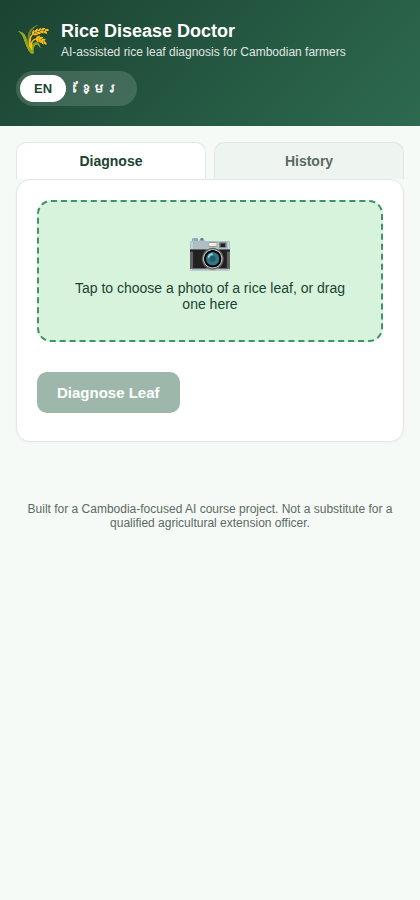
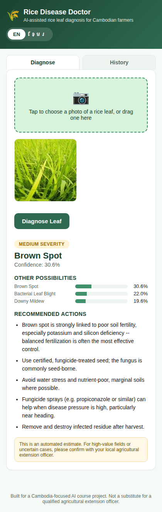
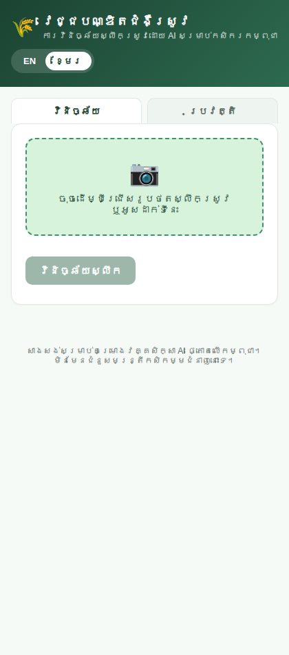
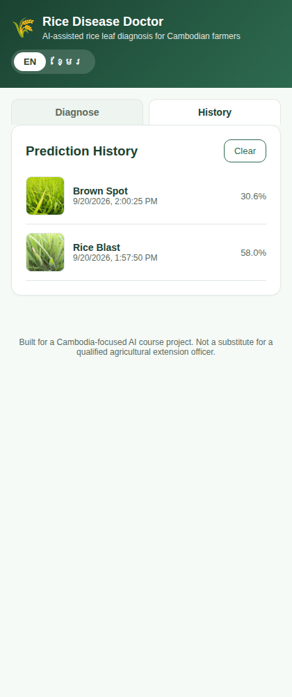
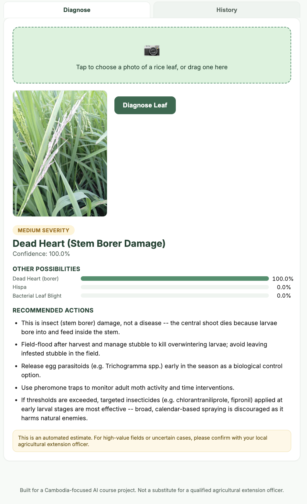
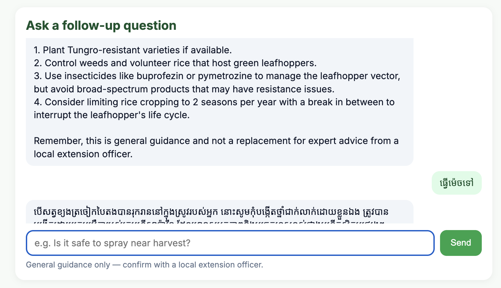

# Rice Disease Doctor 🌾

An AI-powered web app that diagnoses rice leaf diseases and pest damage from a single
photo and returns bilingual (English / Khmer) treatment advice — built for smallholder
rice farmers in Cambodia, where rice is the staple crop and agricultural extension
services are often out of reach for rural growers.

Final project for *Introduction to LLM*.

## The problem

Rice is Cambodia's most important crop, grown by millions of smallholder households,
but early disease detection is a major bottleneck: extension agents are scarce outside
major provinces, farmers often can't identify a disease from visual symptoms alone, and
by the time damage is obvious yields have already been lost. Existing disease-ID apps
are almost all English-only and trained on datasets that don't reflect the varieties and
conditions farmers here actually encounter, and none pair a diagnosis with concrete,
localized treatment guidance. Rice Disease Doctor targets that gap directly: point a
phone camera at a leaf, get an instant diagnosis in Khmer or English, and get practical
next steps, not just a label.

## Screenshots

| Diagnose | Result | Khmer UI | History |
|---|---|---|---|
|  |  |  |  |

Pest damage is distinguished from disease too — e.g. dead heart (stem borer larvae) correctly
identified and flagged as insect damage rather than a fungal/bacterial disease, with matching
advice (field-flooding, egg parasitoids, pheromone traps) instead of a fungicide/antibiotic:



Each diagnosis also includes an optional follow-up chat, for free-text questions about the result (grounded in the treatment reference content, bilingual):



## Features

- **Photo-based diagnosis** — upload or drag-and-drop a leaf photo, get the predicted
  disease/pest class with a confidence score and the top-3 candidates.
- **Bilingual UI** — full English/Khmer toggle, including treatment advice text (not
  just interface labels), using the Noto Sans Khmer typeface for correct rendering.
- **Treatment recommendations** — each of the 10 classes maps to a severity rating and
  a short list of actionable treatment/management steps, sourced from IRRI, CABI, UC
  IPM, and Plantwise agricultural references.
- **Prediction history** — every diagnosis is logged (image + result) to a local
  SQLite database and browsable in a History tab, so a farmer or agent can track
  recurring issues over time.
- **Follow-up chat (RAG)** — ask a free-text follow-up question about the result (e.g. "is it safe to spray near harvest?") and get a grounded answer, in English or Khmer, via retrieval-augmented generation over the treatment reference content. Runs locally for free with Ollama by default; can be switched to OpenAI instead via a few environment variables (see [`CHANGES_AND_SETUP.md`](CHANGES_AND_SETUP.md)).

## How it works


A FastAPI backend loads a fine-tuned ResNet18 checkpoint at startup. An uploaded image
is preprocessed (resize, ImageNet normalization) and run through the model; the
top-3 predictions and a treatment lookup are returned as JSON and rendered by a
single-page vanilla JS/HTML/CSS frontend (no build step). Offline, the same
preprocessing pipeline is used to train and evaluate three model variants (see below).

## Model & approach

Transfer learning on **ResNet18** (ImageNet-pretrained), fine-tuned end-to-end on the
rice disease dataset — **11.2M trainable parameters**. Two additional variants were
trained for comparison:

| Model | Trainable params | Test accuracy | Macro F1 |
|---|---|---|---|
| Baseline — small CNN from scratch | 259,338 | 69.1% | 0.635 |
| Ablation A — frozen ResNet18 backbone (linear probe) | 5,130 | 55.5% | 0.516 |
| **Ablation B / deployed — fine-tuned ResNet18** | **11,181,642** | **88.7%** | **0.876** |

The frozen-backbone ablation actually underperforms the from-scratch baseline — ImageNet
features alone don't transfer well to this fine-grained, domain-specific classification
task, and full fine-tuning is what unlocks the accuracy jump. See [`REPORT.md`](REPORT.md)
for the full writeup, per-class breakdown, and confusion-matrix analysis.


## Dataset

[Paddy Doctor: Paddy Disease Classification](https://www.kaggle.com/competitions/paddy-disease-classification)
— 10,407 labeled rice leaf images across 10 classes (9 diseases/pests + normal),
collected from real paddy fields. Images are resized to 160×160 and split
70/15/15 (train/val/test) with a fixed seed, stratified by class. See
[`training/README.md`](training/README.md) and [`REPORT.md`](REPORT.md) for full data
preparation details.

## Project layout

```
data/                dataset (resized images + manifest.csv split) -- not tracked in git
pretrained/          ImageNet-pretrained ResNet18 checkpoint (see training/README.md)
training/            data split, dataset/model code, training script, run_all.sh
models/              saved checkpoints (*_best.pt) written by training -- not tracked
results/             per-experiment metrics (history.csv, test_eval.json) + summary
backend/             FastAPI app, treatment database, prediction history (SQLite)
frontend/            static web UI (single index.html, no build step)
REPORT.md            full project report
```

## Setup

```bash
pip install -r requirements.txt
```

This repo ships `pretrained/resnet18-5c106cde.pth` (an ImageNet-pretrained ResNet18
checkpoint — see `training/README.md` for why it's bundled instead of downloaded
automatically) but **not** the dataset itself or trained checkpoints, to keep the repo
small. See below to regenerate both.

### Get the data ready

1. Download the dataset from Kaggle: [Paddy Doctor: Paddy Disease Classification](https://www.kaggle.com/competitions/paddy-disease-classification)
   (or the mirror at [imbikramsaha/paddy-doctor](https://www.kaggle.com/datasets/imbikramsaha/paddy-doctor)) and unzip it.
2. Resize the images into what this project expects (`data/paddy_resized_160/<class>/*.jpg`):
   ```bash
   cd training
   python3 resize_dataset.py /path/to/paddy-disease-classification/train_images
   ```
3. Build the train/val/test split manifest:
   ```bash
   python3 make_splits.py    # writes data/manifest.csv
   ```

### Train the models

```bash
cd training
./run_all.sh                            # trains baseline, frozen-ablation, and finetuned models
python3 ../results/make_summary.py      # print/write the results summary table
```

Training auto-detects the best available device (CUDA, then Apple Silicon MPS, then
CPU). Force a specific one with `--device {cpu,cuda,mps}`, e.g.:

```bash
python3 train.py --mode finetuned --epochs 10 --device mps
```

### Run the app

```bash
cd backend
uvicorn app:app --host 0.0.0.0 --port 8000
```

Then open `http://localhost:8000/` in a browser (the backend serves the frontend
directly). The API alone is available under `/api/*`:

| Method | Endpoint | Description |
|---|---|---|
| GET | `/api/health` | Health check |
| POST | `/api/predict` | Upload an image, get diagnosis + treatment advice |
| GET | `/api/history` | List past predictions |
| DELETE | `/api/history` | Clear prediction history |

The app requires `models/finetuned_best.pt` to exist (produced by training the
`finetuned` mode) — without it, `/api/predict` returns a 503 with a clear message.

## Report

The full write-up — problem statement, related work and gap analysis, dataset and
data preparation, model architecture, evaluation methodology, baseline comparison,
ablation study, and system architecture — is in [`REPORT.md`](REPORT.md).

## License

Course project — not licensed for production/commercial use. Dataset and pretrained
weights are subject to their own respective licenses (see `training/README.md`).
