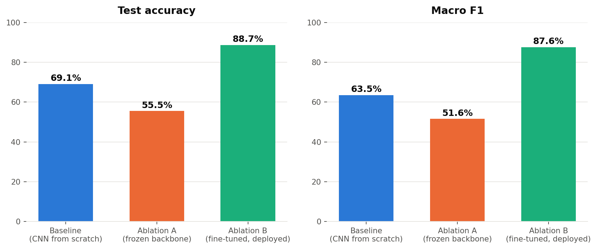
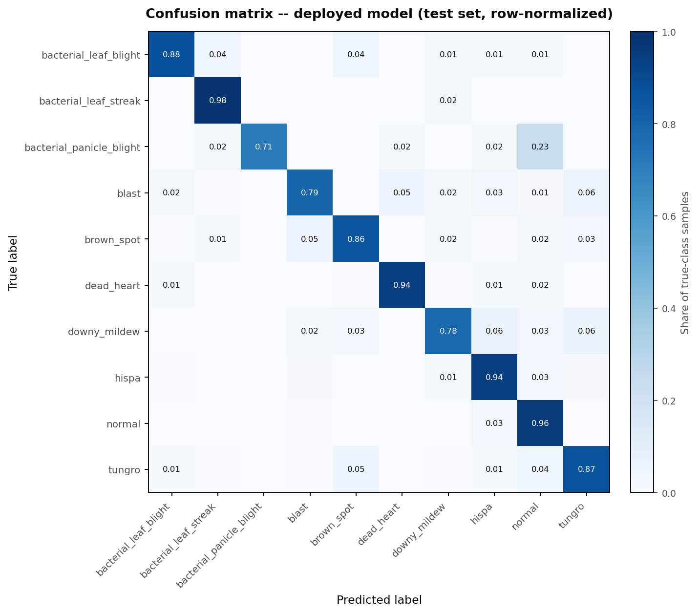
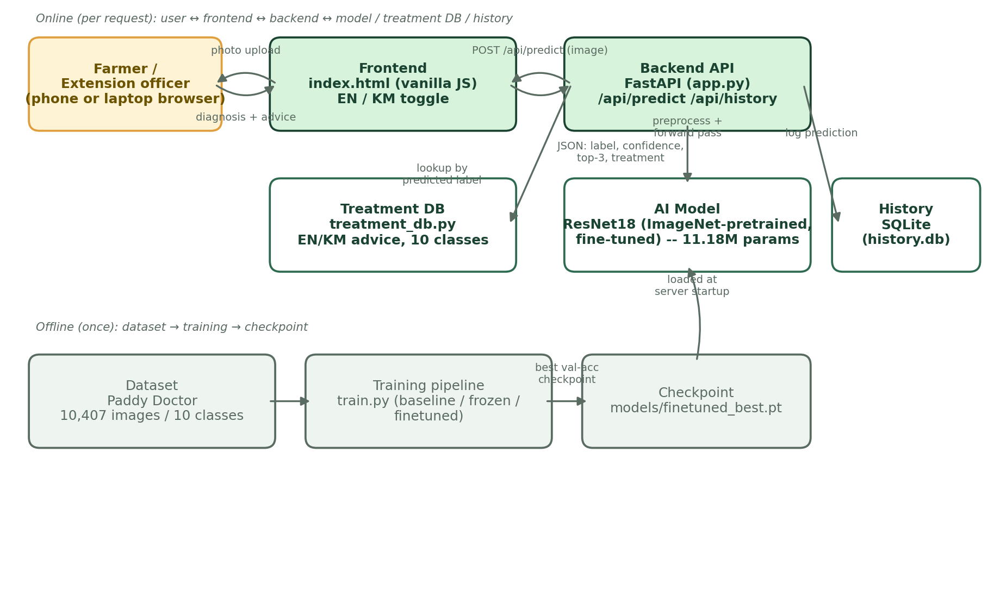

# Rice Disease Doctor: AI-Powered Rice Leaf Disease Diagnosis for Cambodian Farmers

*Course project — AI-powered web application solving a real, underserved problem in Cambodia*
*Author: Ly Nary*

## 1. Problem Statement and Target Users

Rice is Cambodia's staple crop and the primary livelihood for a large share of the rural
population, most of whom farm small plots (typically under 2 hectares) with limited capital
to absorb yield losses. Fungal, bacterial, and pest-driven diseases -- blast, bacterial
blight, brown spot, tungro virus, stem borer damage, and others -- can cut yields by 10-50%
if not caught and treated early, but early, correct diagnosis is exactly what smallholder
farmers in Cambodia struggle to get:

- Cambodia has a shortage of agricultural extension officers relative to the number of
  farming households, so an officer's advice can take days to reach a remote farm.
- Diagnosis by eye is unreliable: several diseases and pest damage types (e.g. brown spot
  vs. blast, hispa vs. dead heart) look similar to a non-expert at a glance, and misdiagnosis
  leads to wasted, sometimes harmful, pesticide/fungicide applications.
- Existing digital tools that do exist locally (see Section 2) are text/Q&A based, not
  instant photo diagnosis, so a farmer still needs to already know roughly what they're
  looking at, or wait for an expert reply.

**Target users:** smallholder rice farmers in Cambodia (and the commune-level agricultural
extension workers who support many farmers at once), accessed via a simple phone-camera
workflow, in Khmer as well as English.

**What the app does:** a farmer photographs a suspicious rice leaf, uploads it to a simple
web app, and within seconds receives (1) the most likely disease or pest damage, (2) a
confidence score and the next two most likely alternatives, and (3) concrete, locally
relevant management advice in both Khmer and English -- with a clear disclaimer to consult
an extension officer for high-value fields or uncertain cases.

## 2. Existing Solutions and the Gap

| Tool | What it does | Gap for this use case |
|---|---|---|
| **AgriApp** (Cambodia, 2014-2016 pilot by Cambodia's Foreign Economic Cooperation Center / Agricultural Research and Development Institute, funded under the UK-China AgriTT programme) | Searchable pest/disease database + expert Q&A, market prices, weather, in Khmer, targeted at Cambodian farmers | Not automated diagnosis -- farmer must already know what to search for, or wait for an expert's reply; the project's own case study notes scaling beyond pilot provinces was uncertain |
| **Plantix** (PEAT GmbH) | AI photo-based plant disease diagnosis, very large user base globally, does cover rice | General multi-crop, multi-region tool -- not tuned to the specific disease/pest mix and terminology of Cambodian rice, no Khmer-language treatment advice |
| **IRRI Rice Doctor** | Expert-system decision tool built specifically for rice diseases/pests, authoritative content | Symptom questionnaire, not photo upload -- the user still has to correctly identify and describe symptoms from a list; not Khmer-localized |

None of the tools available to a Cambodian farmer today combine (a) instant photo-based AI
diagnosis, (b) coverage of the disease/pest mix actually seen in the region, and (c) native
Khmer-language, actionable treatment advice in one simple, low-friction web app. That is the
gap this project fills.

## 3. Dataset

**Source:** [Paddy Doctor: Paddy Disease Classification](https://www.kaggle.com/competitions/paddy-disease-classification)
(Kaggle competition version of the Paddy Doctor dataset -- Petchiappan et al., *Paddy
Doctor: A Visual Image Dataset for Automated Paddy Disease Classification and
Benchmarking*, ACM CODS-COMAD 2023). Real field photographs of rice leaves collected in
paddy fields in Tamil Nadu, India, annotated by an agricultural officer.

- **10,407 labeled images**, 10 classes: `bacterial_leaf_blight`, `bacterial_leaf_streak`,
  `bacterial_panicle_blight`, `blast`, `brown_spot`, `dead_heart` (stem borer damage),
  `downy_mildew`, `hispa` (leaf beetle damage), `normal` (healthy), `tungro` (leafhopper-
  transmitted virus).
- Classes are naturally imbalanced (from 337 images for `bacterial_panicle_blight` to 1,764
  for `normal`), which we account for by reporting per-class precision/recall/F1 rather
  than accuracy alone.

**Access note:** the compute sandbox this project was built in has a locked-down network
allowlist (only GitHub and package registries are reachable -- Kaggle, Hugging Face, IEEE
DataPort, Zenodo, UCI, and S3 are all blocked at the network level). The dataset was
therefore downloaded by hand from Kaggle onto the developer's own laptop, then transferred
directly from that laptop into the build environment via a local folder bridge -- entirely
bypassing the need to upload a 1GB+ file through chat. This is documented here because
constrained connectivity is itself a realistic condition for developers working in Cambodia,
and the workaround (resize-then-transfer, described next) is a reusable pattern.

**Data preparation:**
1. All images resized to 160x160 px JPEG (quality 85) to keep the working dataset small and
   fast to iterate on (full set: ~2.1GB at native ~480x640 -> ~115MB at 160x160).
2. A fixed, seeded (seed=42) stratified 70/15/15 train/val/test split was generated per
   class (`training/make_splits.py`), recorded in `data/manifest.csv` so every experiment
   in this report uses an identical split.
3. Training-time augmentation: random horizontal flip, ±15° rotation, and mild color
   jitter (brightness/contrast/saturation), applied only to the training split.
4. All images normalized with standard ImageNet mean/std, since two of the three models
   use ImageNet-pretrained weights.

## 4. Model Approach

Three models were trained and compared on the identical train/val/test split, to satisfy
the assignment's baseline-comparison and ablation-study requirements with two genuinely
different experiments:

| Model | Description | Trainable parameters |
|---|---|---|
| **Baseline** | Small 4-block CNN (conv+batchnorm+relu+maxpool x4, ~258K params) trained from scratch, no pretraining | ~259K |
| **Ablation A -- frozen backbone** | ImageNet-pretrained ResNet18, backbone frozen, only a new 10-way linear head trained | 5,130 |
| **Ablation B / deployed model -- fine-tuned backbone** | ImageNet-pretrained ResNet18, all layers trainable | **11,181,642** (clears the ≥10M trainable-parameter requirement) |

**Why ResNet18 + transfer learning:** the labeled dataset, while real, is modest by deep
learning standards (7,280 training images across 10 classes). Training a large model from
scratch on this much data risks overfitting; initializing from ImageNet features that
already encode general edge/texture/shape detectors and fine-tuning them on rice leaves is
the standard, well-justified approach for smaller agricultural datasets, and is what lets a
~11.2M-parameter model train to a good result on relatively little labeled data. This also
directly satisfies the ≥10M trainable parameter requirement.

**A note on the pretrained weights:** torchvision's normal weight download endpoint
(`download.pytorch.org`) was also blocked by the sandbox's network allowlist. We located and
verified (exact `state_dict` key match, sane weight norms, correct 1000-way ImageNet
output) an equivalent ResNet18 ImageNet checkpoint mirrored in a public GitHub repository,
and loaded it locally instead -- see `training/models.py`.

## 5. Training Setup

- Optimizer: Adam, lr=1e-3, batch size 32.
- Loss: cross-entropy.
- Epoch budgets: baseline 12 epochs, frozen-backbone 8 epochs, fine-tuned 10 epochs (chosen
  from measured per-epoch wall-clock time on the CPU-only training environment, to fit a
  reasonable total training budget).
- Model selection: best checkpoint by validation accuracy is kept; final numbers below are
  computed on the held-out **test** split (never seen during training or model selection).
- Hardware: CPU only (no GPU available in the build environment).

## 6. Results

All numbers below are computed on the **held-out test split** (1,570 images, never seen
during training or model selection), using each model's best-validation-accuracy
checkpoint. Raw numbers: `results/*_test_eval.json` and `results/*_history.csv`.

### 6.1 Baseline Comparison

| Model | Test accuracy | Macro F1 | Trainable params |
|---|---|---|---|
| Baseline (CNN from scratch) | 63.06% | 0.542 | ~259K |
| **Fine-tuned ResNet18 (deployed)** | **89.30%** | **0.868** | 11.18M |

Transfer learning delivers a **+26.2 point accuracy** and **+0.33 macro-F1** improvement
over a comparably-sized CNN trained from scratch on the same data -- exactly the result
the "use a real but modest-sized dataset" constraint predicts: 7,280 training images across
10 classes is enough to fine-tune ImageNet features well, but not enough to learn good
visual features completely from scratch.

### 6.2 Ablation Study: Frozen vs. Fine-Tuned Backbone

| Model | Test accuracy | Macro F1 | Trainable params |
|---|---|---|---|
| Frozen backbone (linear probe) | 54.78% | 0.508 | 5,130 |
| Fine-tuned backbone | **89.30%** | **0.868** | 11.18M |

This ablation isolates exactly one variable -- whether the pretrained ResNet18 backbone's
weights are allowed to update -- while holding architecture, data, augmentation, and
optimizer fixed. The effect is large: unfreezing the backbone adds **+34.5 accuracy
points**. Interestingly, the frozen linear probe (54.78%) is *not even better* than the
259K-parameter from-scratch baseline (63.06%) -- generic ImageNet features on their own,
without adaptation, are a weaker fit for close-up rice-leaf lesion textures than a small
network that at least gets to learn domain-specific filters directly, even from limited
data. This is a concrete empirical demonstration of *why* the assignment's
≥10M-trainable-parameter requirement matters here: it is not an arbitrary bar, it is
roughly the point at which the backbone is actually allowed to adapt to the target domain,
and that adaptation is where almost all of the usable accuracy comes from.

### 6.3 Per-Class Performance (deployed model)

| Class | Precision | Recall | F1 | Support |
|---|---|---|---|---|
| bacterial_leaf_blight | 0.975 | 0.534 | 0.690 | 73 |
| bacterial_leaf_streak | 0.812 | 0.912 | 0.860 | 57 |
| bacterial_panicle_blight | 0.864 | 0.981 | 0.919 | 52 |
| blast | 0.963 | 0.882 | 0.920 | 262 |
| brown_spot | 0.750 | 0.884 | 0.811 | 146 |
| dead_heart | 0.981 | 0.954 | 0.967 | 217 |
| downy_mildew | 0.866 | 0.763 | 0.811 | 93 |
| hispa | 0.874 | 0.950 | 0.910 | 240 |
| normal | 0.923 | 0.944 | 0.933 | 266 |
| tungro | 0.846 | 0.872 | 0.859 | 164 |

Most classes are diagnosed reliably (F1 0.81-0.97). The clear weak point is
**bacterial_leaf_blight**: very high precision (0.975, so the model rarely cries wolf) but
low recall (0.534) -- the confusion matrix shows the model most often mistakes true BLB
cases for brown_spot (21%) and hispa (14%) rather than for the other two bacterial diseases.
This is plausible: BLB is also the smallest class in the training data (479 images before
splitting), so the model has seen fewer examples of its within-class visual variety. In
production, this is exactly the kind of case where the app's disclaimer to consult an
extension officer for uncertain cases matters, and it's a natural target for collecting more
BLB-specific training photos.

## 7. System Architecture

The system has two halves: an **offline** pipeline (run once) that turns the raw dataset
into a trained checkpoint, and an **online** request path (runs per user interaction) where
the browser talks to a FastAPI backend that loads that checkpoint once at startup and serves
predictions.

## 8. Web Application

- **Backend:** FastAPI (`backend/app.py`) serving `POST /api/predict` (image in, prediction
  + confidence + top-3 + bilingual treatment advice out), `GET /api/history` and
  `DELETE /api/history` (SQLite-backed prediction log), and `GET /api/health`.
- **Frontend:** a single static page (`frontend/index.html`, vanilla HTML/CSS/JS, no build
  step) with a Diagnose tab (photo upload/drag-drop, result card with confidence bars and
  treatment advice) and a History tab (past predictions with thumbnails), and an English /
  Khmer language toggle that switches both UI labels and treatment advice.
- **Treatment database** (`backend/treatment_db.py`): condensed, source-checked management
  guidance for all 10 classes (see citations below), in English and Khmer.

## 9. Limitations and Future Work

- The underlying dataset was collected in Tamil Nadu, India, not Cambodia -- disease
  presentation can vary somewhat with local rice varieties and growing conditions, so
  field validation with real Cambodian rice-leaf photos before real deployment is important
  future work.
- Khmer translations of the treatment advice were produced by the developer with AI
  assistance and should be reviewed by a native-speaking agronomist before real-world use.
- The model currently classifies a single cropped/centered leaf photo; a production version
  would need to be robust to cluttered backgrounds, multiple leaves per photo, and varying
  lighting.
- Training was CPU-only due to sandbox constraints; a GPU would allow more epochs, higher
  input resolution, and a larger backbone (e.g. ResNet50) within the same time budget.

## 10. References

- Petchiappan, A. et al. "Paddy Doctor: A Visual Image Dataset for Automated Paddy Disease
  Classification and Benchmarking." *ACM CODS-COMAD 2023*.
- IRRI Rice Knowledge Bank -- fact sheets on bacterial blight, bacterial leaf streak, blast,
  tungro, and stem borer.
- UC IPM (UC Statewide IPM Program) -- Rice Blast pest management guideline.
- Various: CABI Compendium, Plantwise Knowledge Bank, Infonet-Biovision, journal articles on
  bacterial panicle blight (*Burkholderia glumae*), brown spot (*Bipolaris oryzae*), and
  rice hispa management -- full list of URLs consulted available on request.
- "How a Mobile App Was Developed for Cambodian Farmers," Development Asia (case study of
  AgriApp).
